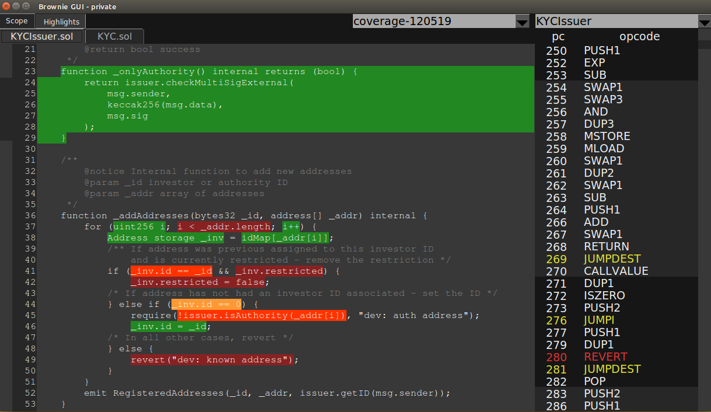

======================
Checking Test Coverage
======================

.. warning:: Test coverage analysis is still under development. You may encounter errors or inaccurate results.

Test coverage is estimated by generating a map of opcodes associated with each function and line of the smart contract source code, and then analyzing the stack trace of each transaction to see which opcodes were executed.

To check your unit test coverage, type:

::

    $ brownie coverage

This will run all the test scripts in the ``tests/`` folder and give an estimate of test coverage:

::

    $ brownie coverage
    Using network 'development'
    Running 'ganache-cli -a 20'...

    Running transfer.py - 1 test
    ✓ Deployment 'token' (0.1882s)
    ✓ Transfer tokens (0.1615s)
    Using network 'development'
    Running 'ganache-cli -a 20'...

    Running approve_transferFrom.py - 3 tests
    ✓ Deployment 'token' (0.1263s)
    ✓ Set approval (0.2016s)
    ✓ Transfer tokens with transferFrom (0.1375s)
    ✓ transerFrom should revert (0.0486s)

    Coverage analysis complete!

    contract: Token
        add - 50.0%
        allowance - 0.0%
        approve - 100.0%
        balanceOf - 0.0%
        decimals - 0.0%
        name - 0.0%
        sub - 75.0%
        symbol - 0.0%
        totalSupply - 0.0%
        transfer - 100.0%
        transferFrom - 100.0%

    Detailed results saved to build/coverage.json

Brownie will output a % score for each contract method, that you can use to quickly gauge your overall coverage level.

The easiest way to analyze specific test coverage is with `opview <https://github.com/iamdefinitelyahuman/opview>`__. From the project root folder, type:

::

    $ opview

This will open the opview GUI.  Then press ``C`` to display the coverage results.  Relevant code will be highlighted in different colors:

* Green - code was executed during the tests
* Yellow - code was executed, but only evaluated truthfully
* Orange - code was executed, but only evaluated falsely
* Red - code was not executed

Coverage JSON Structure
=======================

Analysis results are saved to ``build/coverage.json``. The file contains a list of coverage map items, formatted as follows:

.. code-block:: javascript

    {
        'contract': "", // relative path to the contract source
        'count': 0, // number of transactions that hit this item
        'jump': false, // false, or a 2 item list of transaction counts (see below)
        'method': "", // name of the contract method, if any
        'start': 0, // source code offset start
        'stop': 0 // source code offset stop
    }

If the map item involves a ``JUMPI`` opcode, the ``jump`` field will be a list of two integers. The first is the number of times the mapping evaluated as ``True``, the second is the number of times it evaluated ``False``.

If the mapping does not involved a ``JUMPI`` opcode, ``jump`` will be ``false``.
