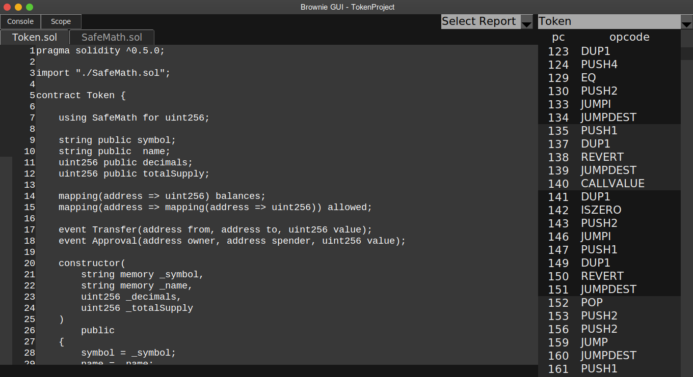
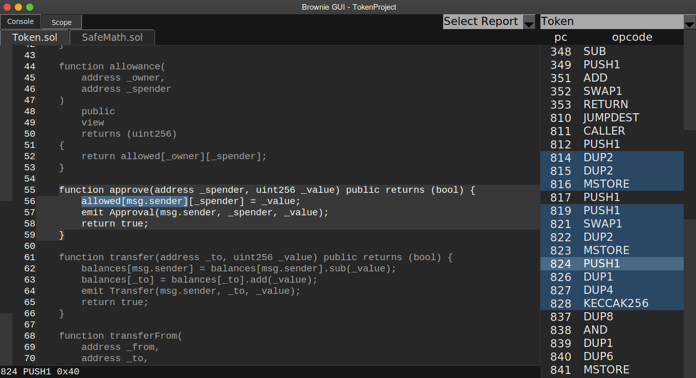
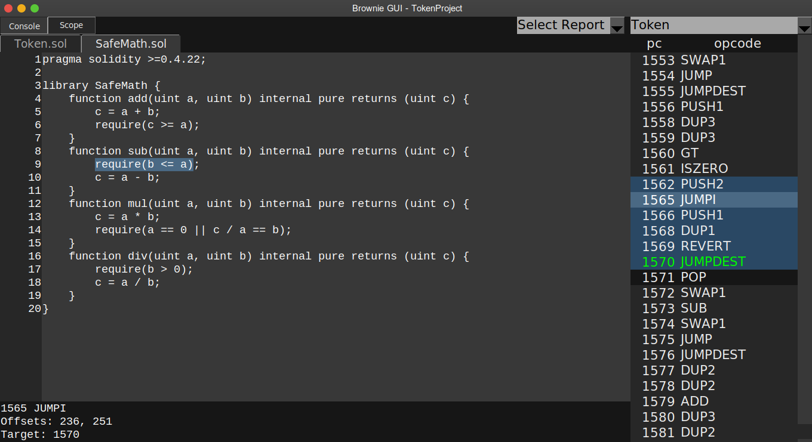

.. _gui:

===============
The Brownie GUI
===============

Brownie includes a GUI for viewing test coverage data and analyzing the compiled bytecode of your contracts.

Parts of this section assume a level of familiarity with EVM bytecode. If you are looking to learn more about the subject, Alejandro Santander from `OpenZeppelin <https://openzeppelin.com/>`_ has written an excellent guide - `Deconstructing a Solidity Contract <https://blog.openzeppelin.com/deconstructing-a-solidity-contract-part-i-introduction-832efd2d7737/>`_.

.. note::

    If you receive an error when attempting to load the GUI, you probably do not have Tk installed on your system. See the :ref:`Tk installation instrucions<install-tk>` for more detailed information.

Getting Started
===============

To open the GUI, run the following command from within your project folder:

::

    $ brownie gui

Or from the console:

.. code-block:: python

    >>> Gui()

Once loaded, the first thing you'll want to do is choose a contract to view. To do this, click on the drop-down list in the upper right that says "Select a Contract". You will see a list of every deployable contract within your project.

Once selected, the contract source code is displayed in the main window with a list of opcodes and program counters on the right. If the contract inherits from more than one source file, tabs will be available to switch between sources. For example, in the image below the ``Token`` contract includes both ``Token.sol`` and ``SafeMath.sol``:

Working with Opcodes
====================

Mapping Opcodes to Source
-------------------------

Highlighting a section of code will also highlight the instructions that are associated with it. Similarly, selecting on an instruction will highlight the related source.

Click the ``Scope`` button in the top left (or the ``S`` key) to filter the list of instructions such that only those contained within the highlighted source are shown.

.. note::

    Opcodes displayed with a dark background are not mapped to any source, or are mapped to the source of the entire contract. These are typically the result of compiler optimization or part of the initial function selector.

Jump Instructions
-----------------

Click the ``Console`` button in the top left (or press the ``C`` key) to expand the console. It shows more detailed information about the highlighted instruction.

    * When you select a ``JUMP`` or ``JUMPI`` instruction, the console includes a "Target:" field that gives the program counter for the related ``JUMPDEST``, where possible. The related ``JUMPDEST`` is also highlighted in green. Press the ``J`` key to show the instruction.
    * When you select a ``JUMPDEST`` instruction, the console includes a "Jumps:" field that gives a list of program counters that point at the highlighted instruction.  Each related ``JUMP``/``JUMPI`` is also highlighted in green.

Miscellaneous
-------------

    * Right clicking on an instruction will apply a yellow highlight to all instructions of the same opcode type.
    * Press the ``R`` key to toggle highlight on all ``REVERT`` opcodes.

.. _coverage-gui:

Viewing Reports
===============

Actions such as coverage evaluation and security analysis produce report files within the ``reports/`` directory of your project. To examine a report:

    1. click on the drop-down list in the upper right that says "Select Report"
    2. Select the report file you wish to view.
    3. A new drop-down list will appear where you can select which report to display.

Some reports will include additional information that is displayed in the GUI console when you hover the mouse over a related section.

Here is an example of a coverage analysis report:

.. image:: gui4.png
   :alt: Viewing Coverage Data

.. _gui-report-json:

Report JSON Format
==================

Third party tools can generate reports for display in the Brownie GUI. Reports must be saved in the ``reports/`` directory of a project. Brownie expects reports to be JSON encoded and use the following structure:

.. code-block:: javascript

    {
        "highlights": {
            // this name is shown in the report type drop-down menu
            "<Report Type>": {
                "ContractName": {
                    "path/to/sourceFile.sol": [
                        // start offset, stop offset, color, optional message
                        [123, 440, "green", ""],
                        [502, 510, "red", ""],
                    ]
                }
            }
        },
        "sha1": {} // optional, not yet implemented
    }

The final item in each highlight offset is an optional message to be displayed. If included, the text given here will be shown in the GUI console when the user hovers the mouse over the highlight. To not show a message, set it to ``""`` or ``null``.
