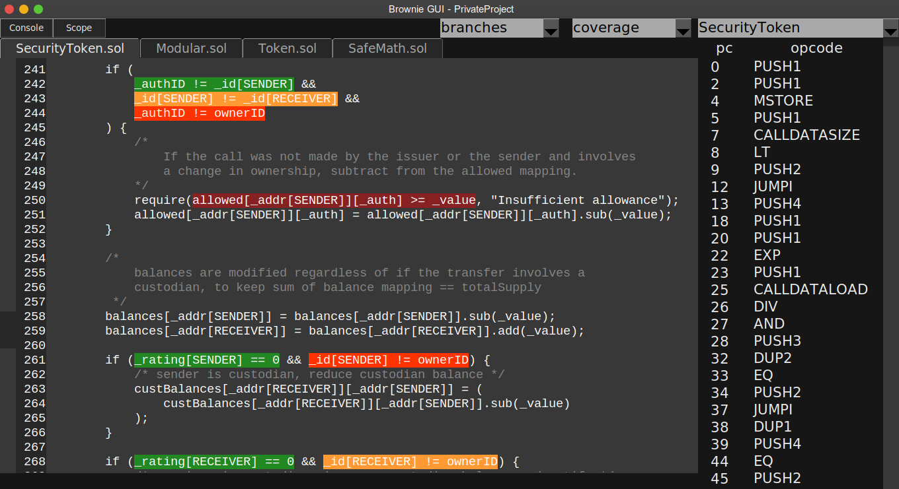

.. _test-coverage:

.. raw:: html

    

.. role:: green
.. role:: yellow
.. role:: orange
.. role:: red

===================
Coverage Evaluation
===================

To check your unit test coverage:

::

    $ brownie test --coverage

When the tests complete, a report will display:

::

    Coverage analysis:

      contract: Token - 82.3%
        SafeMath.add - 66.7%
        SafeMath.sub - 100.0%
        Token.<fallback> - 0.0%
        Token.allowance - 100.0%
        Token.approve - 100.0%
        Token.balanceOf - 100.0%
        Token.decimals - 0.0%
        Token.name - 100.0%
        Token.symbol - 0.0%
        Token.totalSupply - 100.0%
        Token.transfer - 85.7%
        Token.transferFrom - 100.0%

    Coverage report saved at reports/coverage.json

Brownie outputs a % score for each contract method that you can use to quickly gauge your overall coverage level. A detailed coverage report is also saved in the project's ``reports`` folder, that can be viewed via the :ref:`Brownie GUI<gui>`.

Viewing Coverage Data
=====================

For an in-depth examination of your test coverage, first open the Brownie GUI:

::

    brownie gui

Click on the drop-down list in the upper right that says "Select Report" and choose "coverage". A new drop-down list will appear where you can select which type of coverage data to view (branches or statements).

Relevant code will be highlighted in different colors:

    * :green:`Green` code was executed during the tests
    * :yellow:`Yellow` branch code executed, but only evaluated truthfully
    * :orange:`Orange` branch code executed, but only evaluated falsely
    * :red:`Red` code did not execute during the tests

How Coverage Evaluation Works
=============================

Test coverage is calculated by generating a map of opcodes associated with each statement and branch of the source code, and then analyzing the stack trace of each transaction to see which opcodes executed. See `"Evaluating Solidity Code Coverage via Opcode Tracing" <https://medium.com/coinmonks/brownie-evaluating-solidity-code-coverage-via-opcode-tracing-a7cf5a92d28c>`_ for a more detailed explanation of how coverage evaluation works.

Improving Performance
=====================

During coverage analysis, all contract calls are executed as transactions. This gives a more accurate coverage picture by allowing analysis of methods that are typically non-state changing. A snapshot is taken before each of these calls-as-transactions, and the state is reverted immediately after to ensure that the outcome of the test is not affected. For tests that involve many calls this can result in significantly slower execution time.

Some things to keep in mind that can help to reduce your test runtime when evaluating coverage:

    1. Coverage is analyzed on a per-transaction basis, and the results are cached. If you repeat an identical transaction, Brownie will not analyze it the 2nd time. Keep this in mind when designing and sequencing setup fixtures.
    2. For tests that involve many calls to the same getter method, use the :func:`no_call_coverage <pytest.mark.no_call_coverage>` marker to significantly speed execution.
    3. Omit very complex tests altogether with the :func:`skip_coverage <pytest.mark.skip_coverage>` marker.
    4. If possible, always run your tests in parallel with :ref:`xdist<xdist>`.

You can use the ``--durations`` flag to view a profile of your slowest tests. You may find good candidates for optimization, or the use of the :func:`no_call_coverage <pytest.mark.no_call_coverage>` and :func:`skip_coverage <pytest.mark.skip_coverage>` fixtures.
