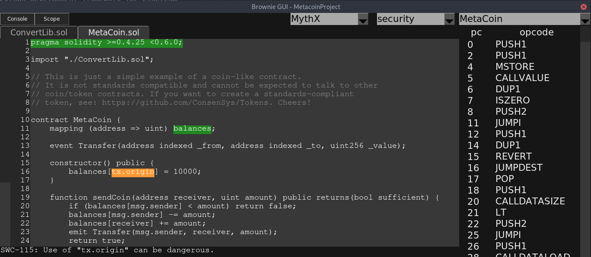

.. _security-analysis:

.. raw:: html

    

.. role:: yellow
.. role:: orange
.. role:: red

============================
Security Analysis with MythX
============================

Brownie is integrated with the `MythX <https://mythx.io/>`_ analysis API to allow automated security scans of your project.

MythX is a smart contract security service that scans your project for vulnerabilities using static analysis, dynamic analysis, and symbolic execution. It runs in three modes:

    1. **Quick mode** which is effective at finding bad coding patterns and low complexity-bugs (available to free users)
    2. **Standard mode** which takes longer to run, but can locate complex security issues (available to Dev users)
    3. **Deep mode** which takes even longer to run, but is able to find deep, hidden vulnerabilities (available to Pro users)

MythX offers both free and paid services. To learn more about how it works you may wish to read `MythX Pro Security Analysis Explained <https://blog.mythx.io/features/mythx-full-mode-security-analysis-explained/#more-37>`_ by Bernhard Mueller.

Authentication
==============

Before you can submit your contracts for analysis you must `sign up <https://dashboard.mythx.io/registration>`_ for a MythX account. Next, login to your account and obtain a JWT token so you can authenticate to the API.

The preferred way to pass your JWT token is via the ``MYTHX_API_KEY`` environment variable. You can set it with the following command:

::

    $ export MYTHX_API_KEY=YourToken

If this is not possible, you may also pass it via the ``--api-key`` commandline option:

::

    $ brownie analyze --api-key=<string>

Scanning for Vulnerabilities
============================

To quickly scan your project for vulnerabilities:

::

    $ brownie analyze

This will send the compiled build artifacts to MythX for analysis. You will receive updates on the status of the scan; the entire process should take around three minutes.

To perform a standard scan:

::

    $ brownie analyze --mode=standard

Note that a deep scan requires authentication and takes approximately half an hour to complete.

If you include the ``--async`` flag Brownie will submit the job, output the pending ID and exit. You can view the finished report later through the MythX dashboard.

Viewing Analysis Results
========================

Once analysis is finished, data about any vulnerabilities is stored in the
:code:`reports/` directory within your project. The report can be viewed using the :ref:`Brownie GUI<gui>`, or by logging into the `MythX dashboard <https://dashboard.mythx.io/>`_.

To view your report in the GUI, first open the GUI:

::

    brownie gui

Alternatively, the :code:`--gui` flag can be passed to the :code:`analyze` subcommand to open the Brownie GUI right away after the analysis results have been received.

::

    brownie analyze --gui

Click on the drop-down list in the upper right that says "Select Report" and choose "security". Then choose ``MythX`` in the new dropdown that appears.

If any vulnerabilities have been found, they will be highlighted based on their severity:

    * :yellow:`Yellow` Low severity (best practice violations)
    * :orange:`Orange` Medium severity (potential vulnerability), needs to be fixed
    * :red:`Red` High severity (critical, immediate danger of exploitation)

You can expand the console by clicking the ``Console`` button in the top left (or pressing the ``C`` key). Hovering the mouse over a vulnerability will displayed a more detailed explanation from the `SWC registry <https://swcregistry.io/>`_.

