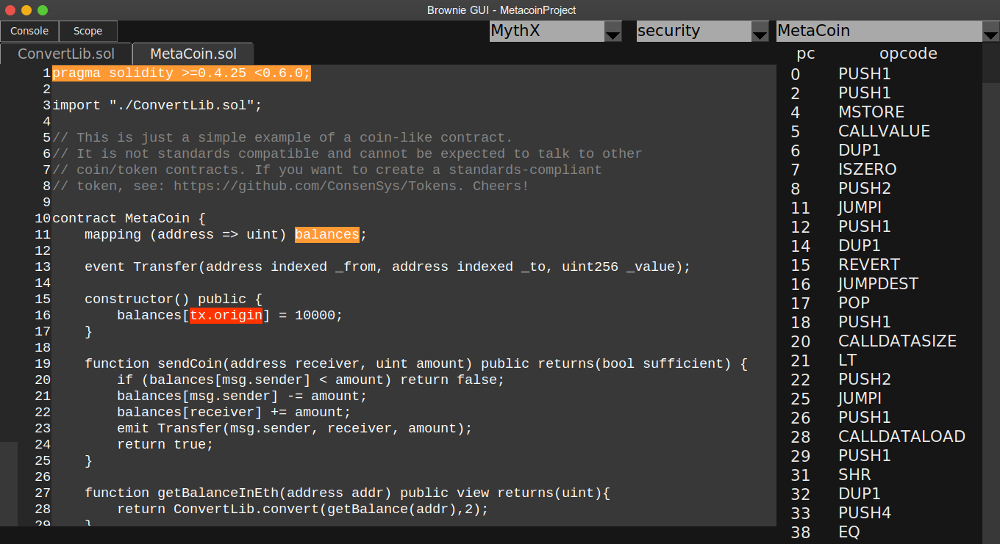

.. _security-analysis:

.. raw:: html

    

.. role:: green
.. role:: yellow
.. role:: orange
.. role:: red

============================
Security Analysis with MythX
============================

Brownie is integrated with the `MythX <https://mythx.io/>`_ analysis API to allow automated security scans of your project.

MythX is a smart contract security service that scans your project for vulnerabilities using static analysis, dynamic analysis, and symbolic execution. It runs in two modes:

    1. **Quick mode** which is effective at finding bad coding patterns and low complexity-bugs
    2. **Full mode** which takes longer to run, but can locate complex security issues

MythX offers both free and paid services. To learn more about how it works you may wish to read `MythX Pro Security Analysis Explained <https://blog.mythx.io/features/mythx-full-mode-security-analysis-explained/#more-37>`_ by Bernhard Mueller.

Scanning for Vulnerabilities
============================

To quickly scan your project for vulnerabilities:

::

    $ brownie analyze

This will send the compiled build artifacts to MythX for analysis. You will receive updates on the status of the scan; the entire process should take around three minutes.

To perform a full scan:

::

    $ brownie analyze --full

Note that a full scan requires authentication and takes approximately half an hour to complete.

If you include the ``--async`` flag Brownie will submit the job, output the pending ID and exit. You can view the finished report later through the MythX dashboard.

Authentication
==============

In order to perform a full scan or track your analysis history, you are required to authenticate. This can be done using either a JWT token obtained from the `MythX dashboard <https://dashboard.mythx.io/>`_, or with your username and password.

With a JWT Token
----------------

The preferred way to pass your JWT token is via the ``MYTHX_ACCESS_TOKEN`` environment variable. You can set it with the following command:

::

    $ export MYTHX_ACCESS_TOKEN=YourToken

If this is not possible, you may also pass it via the ``--access-token`` commandline option:

::

    $ brownie analyze --access-token=<string>

With your Username and Password
-------------------------------

The preferred way to pass your username and password is via the ``MYTHX_ETH_ADDRESS`` and ``MYTHX_PASSWORD`` environment variables. Set them with the following commands:

::

    $ export MYTHX_ETH_ADDRESS=YourAddress
    $ export MYTHX_PASSWORD=YourPassword

If this is not possible, you may also pass them via the commandline:

::

    $ brownie analyze --eth-address=<string> --password=<string>

Viewing Analysis Results
========================

Once analysis is finished, data about any vulnerabilities is stored in the
:code:`reports/` directory within your project. The report can be viewed using the :ref:`Brownie GUI<gui>`, or by logging into the `MythX dashboard <https://dashboard.mythx.io/>`_.

To view your report in the GUI, first open the GUI:

::

    brownie gui

Click on the drop-down list in the upper right that says "Select Report" and choose "security". Then choose ``MythX`` in the new dropdown that appears.

If any vulnerabilities have been found, they will be highlighted based on their severity:

    * :green:`Green` Low severity (best practice violations)
    * :yellow:`Yellow` Medium severity (potential vulnerability), needs to be fixed
    * :red:`Red` High severity (critical, immediate danger of exploitation)

You can expand the console by clicking the ``Console`` button in the top left (or pressing the ``C`` key). Hovering the mouse over a vulnerability will displayed a more detailed explanation from the `SWC registry <https://swcregistry.io/>`_.

